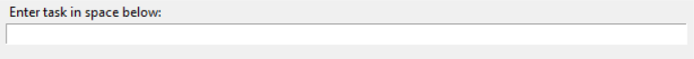
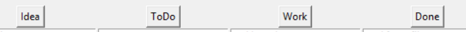
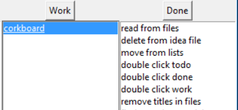
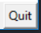

# To Do Station

Welcome to my To Do Station. This README file will explain how to use the program,
as well as keep a log of the different updates that come now after the first version
is officially released. 

## How to use

The station is used by running the file 'corkboard.py' in this same folder.

### New Tasks

Use the entry box to insert new task. Send the task directly to the Idea List by pressing
'enter' or click on the respective button for the task's desired list. 

### Select Task

A task can be be moved to the next list (to the right) by double-clicking it. A possible
triple-click for moving backwards may be implemented in the next update.

### Exit

To end the program, click on the 'Quit' button on the bottom right corner.

